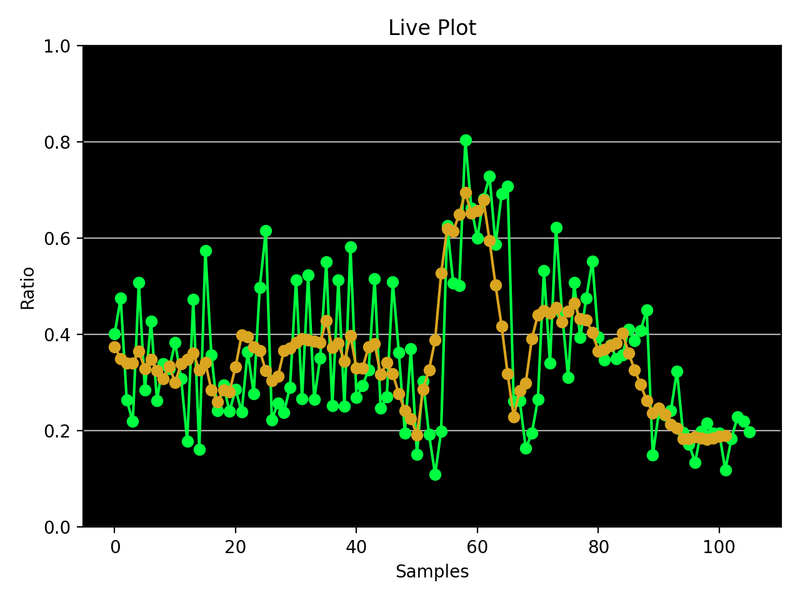

## Power of Smile : Flappy Bird controlled using smile
Power of Smile is a semester project for COM-VP module. Flappy Bird game is designed to take facial inputs (smile) of the player to the steer the bird through various obstacles. 
This game is developed using 2 modules:
1. OpenCv: In this module, we developed the module which takes facial input to steer the bird in the game.
2. Pygame: Pygame is a set of Python modules designed for writing game operations.
## Setup (as tested on MacOS)
1. Clone the repository:
```
$ git clone https://github.com/prakharbhardwaj1/Powerofsmile_FlappyBird-OpenCv
```
2. install requirements from requirement.txt file:
```
$ pip3 install -r requirements.txt
```
3. In the root directory run:
```
$ python3 game.py
```
4. Now, smile to play the game!


 ### Plot of MAR ratio and moving average before and after playing the game
    

## References

https://github.com/sourabhv/FlapPyBird

https://github.com/wangsongyuan98/FlappyBird_And_OpenCV

https://github.com/popadi/python-flappy-bird

https://github.com/prakhargurawa/Drowsiness-Detection-OpenCV (for MAR Ratio)

https://www.kaggle.com/datasets/sergiovirahonda/shape-predictor-68-face-landmarksdat (Facial landmarks pretrained file)

 


